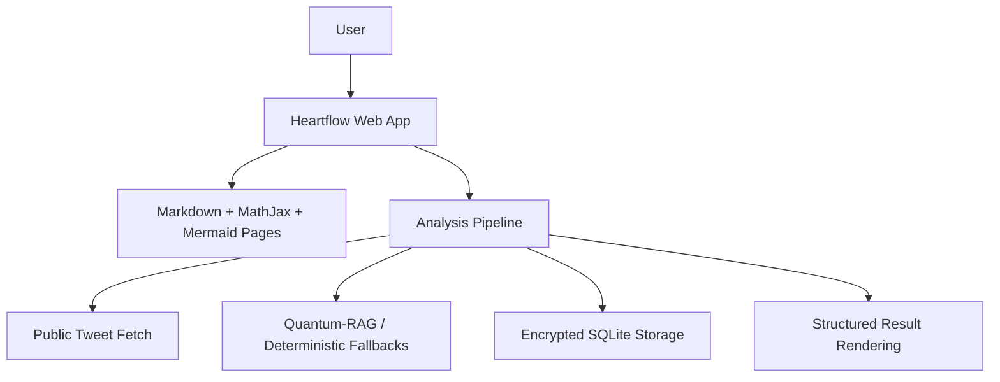
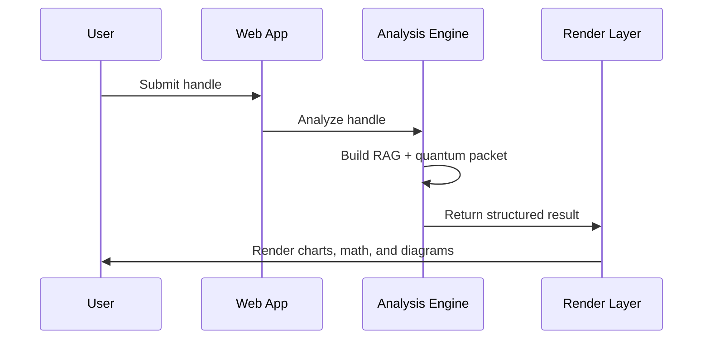
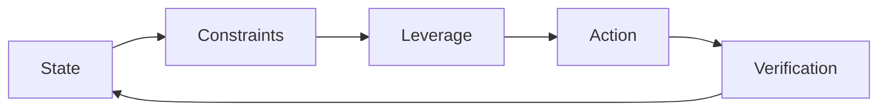
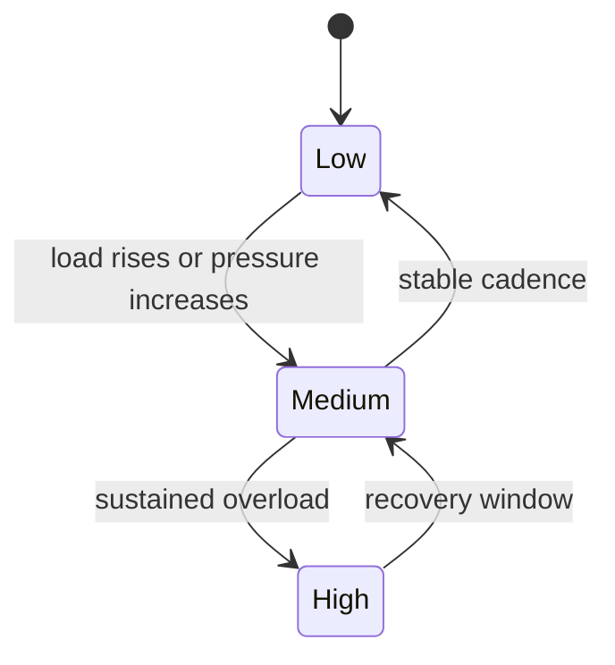

# Heartflow

Heartflow is a Flask app for structured analysis, encrypted storage, and markdown-based report pages with MathJax and Mermaid.


## Quickstart

```bash
python main.py
```

## What it includes
- Home analyzer dashboard
- About and Creators pages with markdown, MathJax, and Mermaid rendering
- AES-GCM encrypted SQLite storage
- CSRF protection, rate limiting, and hardened security headers
- Optional OpenAI-backed structured analysis

## Architecture



## Render Flow



## Life Optimization Loop



## Safety Scanner States



## Local assets
- MathJax is vendored in `static/vendor/mathjax/`
- Orbitron is vendored in `static/vendor/orbitron/`
- Mermaid is vendored in `static/vendor/mermaid/`

## Configuration
Required:
- `ENCRYPTION_PASSPHRASE`

Optional:
- `ENCRYPTION_SALT_B64`
- `ENCRYPTION_BOOT_NONCE_B64`
- `OPENAI_API_KEY`
- `HF_OPENAI_MODEL`
- `HF_OPENAI_BASE_URL`
- `TWITTER_BEARER_TOKEN`
- `X_COMPLIANCE_STRICT`
- `FLASK_SECRET_KEY`
- `HF_DB_PATH`
- `PORT`

## Production example

```bash
gunicorn main:app -b 0.0.0.0:${PORT:-3000} -w ${WEB_CONCURRENCY:-2} -k gthread --threads 4
```

## Notes
- In strict mode, X API access requires `TWITTER_BEARER_TOKEN`.
- The database defaults to `/var/data/hf_secure.db`.
- About and Creators pages now support fenced `mermaid` blocks, so diagrams render directly from markdown.
- GitHub will render the Mermaid fences in this README automatically.
